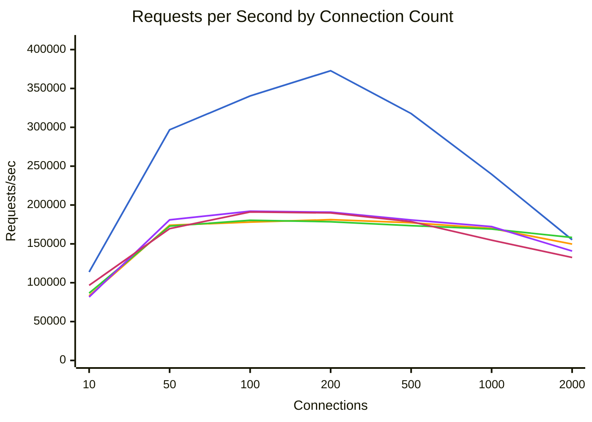
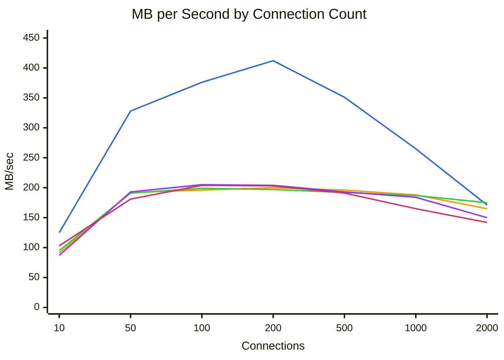
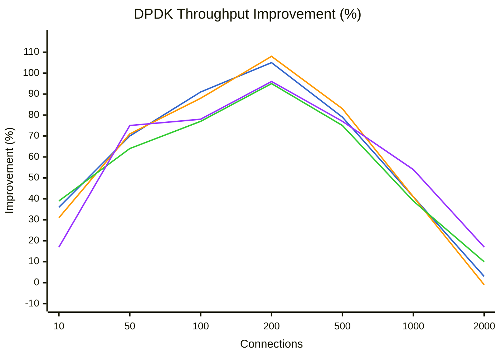
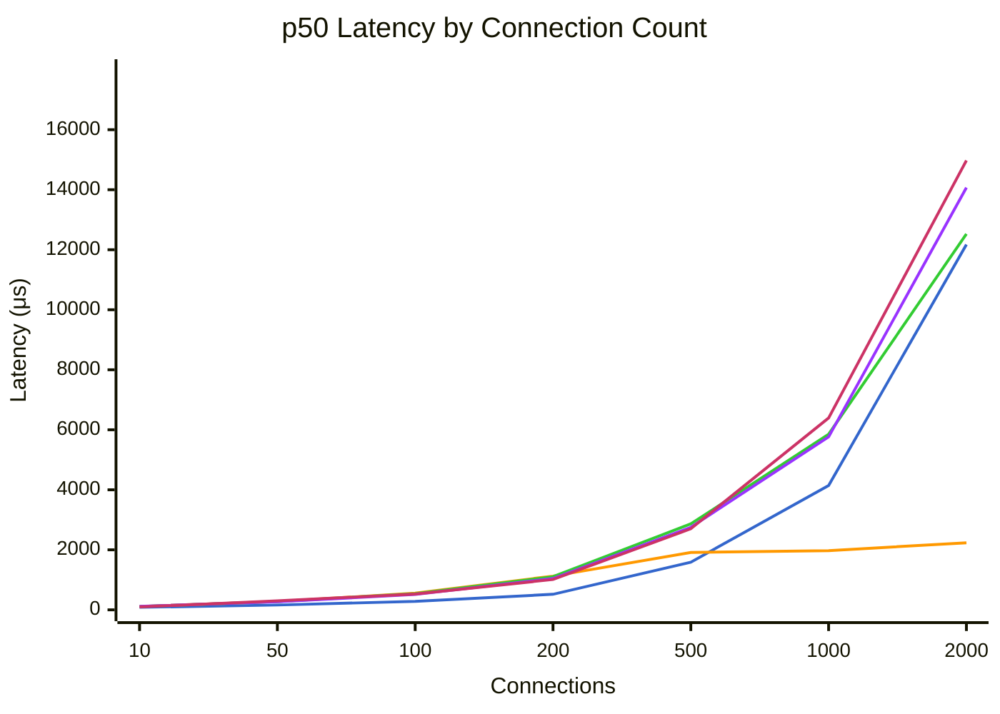
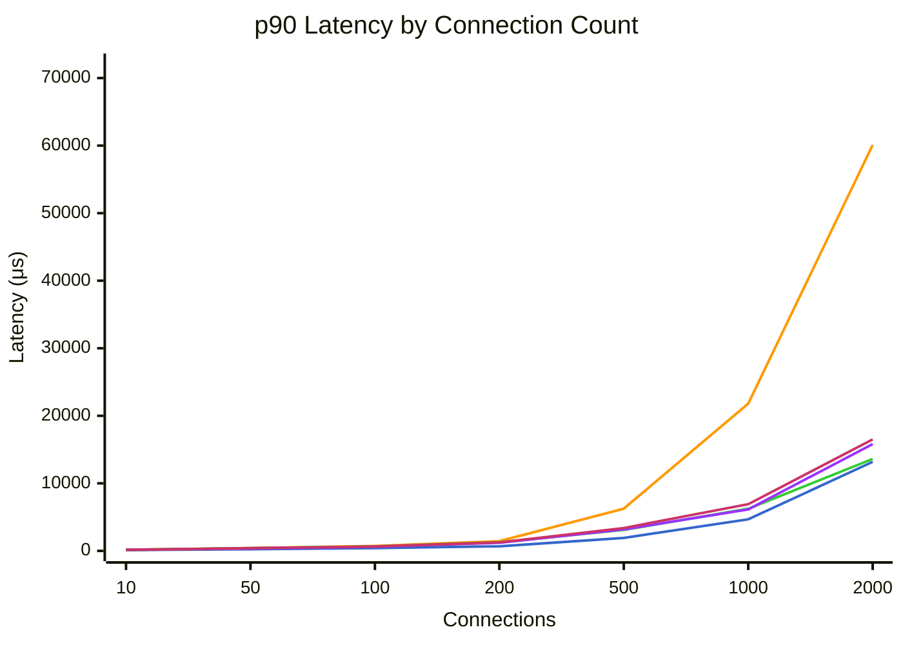
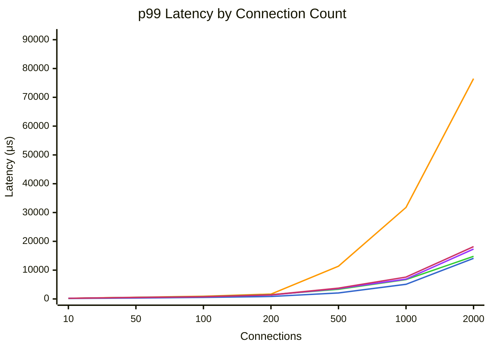

# Benchmark Comparison

Generated: 2026-01-30T20:26:03.558354

Modes tested: dpdk, tokio, tokio-local, kimojio, kimojio-poll

## Summary

| Mode | Connections | Requests/sec | MB/sec | p50 (μs) | p99 (μs) | Errors |
|------|-------------|--------------|--------|----------|----------|--------|
| dpdk | 10 | 113879 | 125.9 | 83 | 167 | 0 |
| dpdk | 50 | 296839 | 328.4 | 160 | 329 | 0 |
| dpdk | 100 | 340304 | 376.7 | 283 | 540 | 0 |
| dpdk | 200 | 372840 | 412.8 | 518 | 847 | 0 |
| dpdk | 500 | 317700 | 351.8 | 1588 | 2077 | 0 |
| dpdk | 1000 | 239566 | 265.2 | 4143 | 5087 | 0 |
| dpdk | 2000 | 155304 | 171.9 | 12175 | 14087 | 0 |
| tokio | 10 | 83165 | 92.0 | 113 | 240 | 0 |
| tokio | 50 | 173997 | 192.5 | 277 | 568 | 0 |
| tokio | 100 | 177996 | 196.9 | 556 | 937 | 0 |
| tokio | 200 | 181154 | 200.5 | 1124 | 1684 | 0 |
| tokio | 500 | 177205 | 196.2 | 1912 | 11375 | 0 |
| tokio | 1000 | 169848 | 188.1 | 1974 | 31775 | 0 |
| tokio | 2000 | 149738 | 165.8 | 2233 | 76479 | 0 |
| tokio-local | 10 | 86603 | 95.8 | 111 | 233 | 0 |
| tokio-local | 50 | 172852 | 191.2 | 278 | 530 | 0 |
| tokio-local | 100 | 180303 | 199.5 | 540 | 805 | 0 |
| tokio-local | 200 | 178492 | 197.6 | 1105 | 1474 | 0 |
| tokio-local | 500 | 173476 | 192.1 | 2865 | 3365 | 0 |
| tokio-local | 1000 | 169081 | 187.2 | 5851 | 6715 | 0 |
| tokio-local | 2000 | 158186 | 175.2 | 12527 | 14783 | 0 |
| kimojio | 10 | 81677 | 87.4 | 118 | 241 | 0 |
| kimojio | 50 | 180909 | 193.8 | 270 | 465 | 0 |
| kimojio | 100 | 192020 | 205.7 | 514 | 726 | 0 |
| kimojio | 200 | 190750 | 204.4 | 1043 | 1363 | 0 |
| kimojio | 500 | 180771 | 193.8 | 2751 | 3609 | 0 |
| kimojio | 1000 | 172206 | 184.6 | 5763 | 6871 | 0 |
| kimojio | 2000 | 140759 | 150.9 | 14071 | 17311 | 0 |
| kimojio-poll | 10 | 96625 | 103.4 | 97 | 211 | 0 |
| kimojio-poll | 50 | 169552 | 181.6 | 298 | 534 | 0 |
| kimojio-poll | 100 | 191071 | 204.6 | 526 | 767 | 0 |
| kimojio-poll | 200 | 189807 | 203.4 | 1011 | 1409 | 0 |
| kimojio-poll | 500 | 178629 | 191.5 | 2701 | 3757 | 0 |
| kimojio-poll | 1000 | 154766 | 165.9 | 6395 | 7591 | 0 |
| kimojio-poll | 2000 | 132488 | 142.0 | 14975 | 18159 | 0 |

## Throughput Comparison



**Legend:** dpdk (blue) | tokio (orange) | tokio-local (green) | kimojio (purple) | kimojio-poll (pink)


## Bandwidth Comparison



**Legend:** dpdk (blue) | tokio (orange) | tokio-local (green) | kimojio (purple) | kimojio-poll (pink)


## DPDK Throughput Improvement

Percentage improvement of DPDK over other modes (positive = DPDK is faster).



**Legend:** vs tokio (blue) | vs tokio-local (orange) | vs kimojio (green) | vs kimojio-poll (purple)


## Latency Comparison (p50)



**Legend:** dpdk (blue) | tokio (orange) | tokio-local (green) | kimojio (purple) | kimojio-poll (pink)


## Latency Comparison (p90)



**Legend:** dpdk (blue) | tokio (orange) | tokio-local (green) | kimojio (purple) | kimojio-poll (pink)


## Latency Comparison (p99)



**Legend:** dpdk (blue) | tokio (orange) | tokio-local (green) | kimojio (purple) | kimojio-poll (pink)


## Raw Data

### dpdk

<details>
<summary>Click to expand</summary>

```json
{
  "benchmark_time": "2026-01-31T04:12:22+00:00",
  "results": [
    {
      "url": "http://10.0.0.5:8080/",
      "connections": 10,
      "duration_secs": 20.0,
      "mode": "raw",
      "worker_threads": 8,
      "timeout_ms": 5000,
      "requests": 2277585,
      "errors": 0,
      "gb_read": 2.46,
      "requests_per_sec": 113879.25,
      "mb_per_sec": 125.93,
      "latency": {
        "p50_us": 83,
        "p75_us": 96,
        "p90_us": 111,
        "p99_us": 167,
        "avg_us": 86,
        "max_us": 7023,
        "stdev_us": 37
      }
    },
    {
      "url": "http://10.0.0.5:8080/",
      "connections": 50,
      "duration_secs": 20.0,
      "mode": "raw",
      "worker_threads": 8,
      "timeout_ms": 5000,
      "requests": 5936781,
      "errors": 0,
      "gb_read": 6.41,
      "requests_per_sec": 296839.05,
      "mb_per_sec": 328.38,
      "latency": {
        "p50_us": 160,
        "p75_us": 200,
        "p90_us": 244,
        "p99_us": 329,
        "avg_us": 169,
        "max_us": 2329,
        "stdev_us": 55
      }
    },
    {
      "url": "http://10.0.0.5:8080/",
      "connections": 100,
      "duration_secs": 20.0,
      "mode": "raw",
      "worker_threads": 8,
      "timeout_ms": 5000,
      "requests": 6806077,
      "errors": 0,
      "gb_read": 7.36,
      "requests_per_sec": 340303.85,
      "mb_per_sec": 376.7,
      "latency": {
        "p50_us": 283,
        "p75_us": 349,
        "p90_us": 415,
        "p99_us": 540,
        "avg_us": 292,
        "max_us": 4811,
        "stdev_us": 92
      }
    },
    {
      "url": "http://10.0.0.5:8080/",
      "connections": 200,
      "duration_secs": 20.0,
      "mode": "raw",
      "worker_threads": 8,
      "timeout_ms": 5000,
      "requests": 7456803,
      "errors": 0,
      "gb_read": 8.06,
      "requests_per_sec": 372840.15,
      "mb_per_sec": 412.81,
      "latency": {
        "p50_us": 518,
        "p75_us": 574,
        "p90_us": 685,
        "p99_us": 847,
        "avg_us": 535,
        "max_us": 8311,
        "stdev_us": 116
      }
    },
    {
      "url": "http://10.0.0.5:8080/",
      "connections": 500,
      "duration_secs": 20.0,
      "mode": "raw",
      "worker_threads": 8,
      "timeout_ms": 5000,
      "requests": 6353992,
      "errors": 0,
      "gb_read": 6.87,
      "requests_per_sec": 317699.6,
      "mb_per_sec": 351.76,
      "latency": {
        "p50_us": 1588,
        "p75_us": 1774,
        "p90_us": 1921,
        "p99_us": 2077,
        "avg_us": 1571,
        "max_us": 12575,
        "stdev_us": 274
      }
    },
    {
      "url": "http://10.0.0.5:8080/",
      "connections": 1000,
      "duration_secs": 20.0,
      "mode": "raw",
      "worker_threads": 8,
      "timeout_ms": 5000,
      "requests": 4791312,
      "errors": 0,
      "gb_read": 5.18,
      "requests_per_sec": 239565.6,
      "mb_per_sec": 265.25,
      "latency": {
        "p50_us": 4143,
        "p75_us": 4423,
        "p90_us": 4675,
        "p99_us": 5087,
        "avg_us": 4159,
        "max_us": 25855,
        "stdev_us": 448
      }
    },
    {
      "url": "http://10.0.0.5:8080/",
      "connections": 2000,
      "duration_secs": 20.0,
      "mode": "raw",
      "worker_threads": 8,
      "timeout_ms": 5000,
      "requests": 3106073,
      "errors": 0,
      "gb_read": 3.36,
      "requests_per_sec": 155303.65,
      "mb_per_sec": 171.95,
      "latency": {
        "p50_us": 12175,
        "p75_us": 12711,
        "p90_us": 13191,
        "p99_us": 14087,
        "avg_us": 12812,
        "max_us": 669695,
        "stdev_us": 11873
      }
    }
  ]
}
```

</details>

### tokio

<details>
<summary>Click to expand</summary>

```json
{
  "benchmark_time": "2026-01-31T04:15:41+00:00",
  "results": [
    {
      "url": "http://10.0.0.4:8080/",
      "connections": 10,
      "duration_secs": 20.0,
      "mode": "raw",
      "worker_threads": 8,
      "timeout_ms": 5000,
      "requests": 1663294,
      "errors": 0,
      "gb_read": 1.8,
      "requests_per_sec": 83164.7,
      "mb_per_sec": 91.95,
      "latency": {
        "p50_us": 113,
        "p75_us": 141,
        "p90_us": 170,
        "p99_us": 240,
        "avg_us": 119,
        "max_us": 8823,
        "stdev_us": 50
      }
    },
    {
      "url": "http://10.0.0.4:8080/",
      "connections": 50,
      "duration_secs": 20.0,
      "mode": "raw",
      "worker_threads": 8,
      "timeout_ms": 5000,
      "requests": 3479946,
      "errors": 0,
      "gb_read": 3.76,
      "requests_per_sec": 173997.3,
      "mb_per_sec": 192.49,
      "latency": {
        "p50_us": 277,
        "p75_us": 331,
        "p90_us": 393,
        "p99_us": 568,
        "avg_us": 286,
        "max_us": 8415,
        "stdev_us": 93
      }
    },
    {
      "url": "http://10.0.0.4:8080/",
      "connections": 100,
      "duration_secs": 20.0,
      "mode": "raw",
      "worker_threads": 8,
      "timeout_ms": 5000,
      "requests": 3559920,
      "errors": 0,
      "gb_read": 3.85,
      "requests_per_sec": 177996.0,
      "mb_per_sec": 196.91,
      "latency": {
        "p50_us": 556,
        "p75_us": 649,
        "p90_us": 734,
        "p99_us": 937,
        "avg_us": 560,
        "max_us": 8247,
        "stdev_us": 153
      }
    },
    {
      "url": "http://10.0.0.4:8080/",
      "connections": 200,
      "duration_secs": 20.0,
      "mode": "raw",
      "worker_threads": 8,
      "timeout_ms": 5000,
      "requests": 3623082,
      "errors": 0,
      "gb_read": 3.92,
      "requests_per_sec": 181154.1,
      "mb_per_sec": 200.51,
      "latency": {
        "p50_us": 1124,
        "p75_us": 1297,
        "p90_us": 1440,
        "p99_us": 1684,
        "avg_us": 1102,
        "max_us": 6307,
        "stdev_us": 283
      }
    },
    {
      "url": "http://10.0.0.4:8080/",
      "connections": 500,
      "duration_secs": 20.0,
      "mode": "raw",
      "worker_threads": 8,
      "timeout_ms": 5000,
      "requests": 3544099,
      "errors": 0,
      "gb_read": 3.83,
      "requests_per_sec": 177204.95,
      "mb_per_sec": 196.2,
      "latency": {
        "p50_us": 1912,
        "p75_us": 2731,
        "p90_us": 6255,
        "p99_us": 11375,
        "avg_us": 2816,
        "max_us": 209791,
        "stdev_us": 2347
      }
    },
    {
      "url": "http://10.0.0.4:8080/",
      "connections": 1000,
      "duration_secs": 20.0,
      "mode": "raw",
      "worker_threads": 8,
      "timeout_ms": 5000,
      "requests": 3396963,
      "errors": 0,
      "gb_read": 3.67,
      "requests_per_sec": 169848.15,
      "mb_per_sec": 188.06,
      "latency": {
        "p50_us": 1974,
        "p75_us": 2685,
        "p90_us": 21807,
        "p99_us": 31775,
        "avg_us": 5863,
        "max_us": 67007,
        "stdev_us": 8543
      }
    },
    {
      "url": "http://10.0.0.4:8080/",
      "connections": 2000,
      "duration_secs": 20.0,
      "mode": "raw",
      "worker_threads": 8,
      "timeout_ms": 5000,
      "requests": 2994751,
      "errors": 0,
      "gb_read": 3.24,
      "requests_per_sec": 149737.55,
      "mb_per_sec": 165.79,
      "latency": {
        "p50_us": 2233,
        "p75_us": 3047,
        "p90_us": 60095,
        "p99_us": 76479,
        "avg_us": 13312,
        "max_us": 197375,
        "stdev_us": 23729
      }
    }
  ]
}
```

</details>

### tokio-local

<details>
<summary>Click to expand</summary>

```json
{
  "benchmark_time": "2026-01-31T04:19:00+00:00",
  "results": [
    {
      "url": "http://10.0.0.4:8080/",
      "connections": 10,
      "duration_secs": 20.0,
      "mode": "raw",
      "worker_threads": 8,
      "timeout_ms": 5000,
      "requests": 1732069,
      "errors": 0,
      "gb_read": 1.87,
      "requests_per_sec": 86603.45,
      "mb_per_sec": 95.75,
      "latency": {
        "p50_us": 111,
        "p75_us": 138,
        "p90_us": 164,
        "p99_us": 233,
        "avg_us": 117,
        "max_us": 203007,
        "stdev_us": 205
      }
    },
    {
      "url": "http://10.0.0.4:8080/",
      "connections": 50,
      "duration_secs": 20.0,
      "mode": "raw",
      "worker_threads": 8,
      "timeout_ms": 5000,
      "requests": 3457049,
      "errors": 0,
      "gb_read": 3.73,
      "requests_per_sec": 172852.45,
      "mb_per_sec": 191.22,
      "latency": {
        "p50_us": 278,
        "p75_us": 346,
        "p90_us": 415,
        "p99_us": 530,
        "avg_us": 284,
        "max_us": 6787,
        "stdev_us": 101
      }
    },
    {
      "url": "http://10.0.0.4:8080/",
      "connections": 100,
      "duration_secs": 20.0,
      "mode": "raw",
      "worker_threads": 8,
      "timeout_ms": 5000,
      "requests": 3606067,
      "errors": 0,
      "gb_read": 3.9,
      "requests_per_sec": 180303.35,
      "mb_per_sec": 199.46,
      "latency": {
        "p50_us": 540,
        "p75_us": 599,
        "p90_us": 665,
        "p99_us": 805,
        "avg_us": 549,
        "max_us": 206207,
        "stdev_us": 165
      }
    },
    {
      "url": "http://10.0.0.4:8080/",
      "connections": 200,
      "duration_secs": 20.0,
      "mode": "raw",
      "worker_threads": 8,
      "timeout_ms": 5000,
      "requests": 3569835,
      "errors": 0,
      "gb_read": 3.86,
      "requests_per_sec": 178491.75,
      "mb_per_sec": 197.57,
      "latency": {
        "p50_us": 1105,
        "p75_us": 1198,
        "p90_us": 1279,
        "p99_us": 1474,
        "avg_us": 1111,
        "max_us": 4183,
        "stdev_us": 136
      }
    },
    {
      "url": "http://10.0.0.4:8080/",
      "connections": 500,
      "duration_secs": 20.0,
      "mode": "raw",
      "worker_threads": 8,
      "timeout_ms": 5000,
      "requests": 3469516,
      "errors": 0,
      "gb_read": 3.75,
      "requests_per_sec": 173475.8,
      "mb_per_sec": 192.08,
      "latency": {
        "p50_us": 2865,
        "p75_us": 2999,
        "p90_us": 3103,
        "p99_us": 3365,
        "avg_us": 2876,
        "max_us": 11679,
        "stdev_us": 224
      }
    },
    {
      "url": "http://10.0.0.4:8080/",
      "connections": 1000,
      "duration_secs": 20.0,
      "mode": "raw",
      "worker_threads": 8,
      "timeout_ms": 5000,
      "requests": 3381626,
      "errors": 0,
      "gb_read": 3.66,
      "requests_per_sec": 169081.3,
      "mb_per_sec": 187.21,
      "latency": {
        "p50_us": 5851,
        "p75_us": 6039,
        "p90_us": 6243,
        "p99_us": 6715,
        "avg_us": 5890,
        "max_us": 28863,
        "stdev_us": 371
      }
    },
    {
      "url": "http://10.0.0.4:8080/",
      "connections": 2000,
      "duration_secs": 20.0,
      "mode": "raw",
      "worker_threads": 8,
      "timeout_ms": 5000,
      "requests": 3163712,
      "errors": 0,
      "gb_read": 3.42,
      "requests_per_sec": 158185.6,
      "mb_per_sec": 175.15,
      "latency": {
        "p50_us": 12527,
        "p75_us": 13119,
        "p90_us": 13615,
        "p99_us": 14783,
        "avg_us": 12576,
        "max_us": 70335,
        "stdev_us": 1071
      }
    }
  ]
}
```

</details>

### kimojio

<details>
<summary>Click to expand</summary>

```json
{
  "benchmark_time": "2026-01-31T04:22:19+00:00",
  "results": [
    {
      "url": "http://10.0.0.4:8080/",
      "connections": 10,
      "duration_secs": 20.0,
      "mode": "raw",
      "worker_threads": 8,
      "timeout_ms": 5000,
      "requests": 1633545,
      "errors": 0,
      "gb_read": 1.71,
      "requests_per_sec": 81677.25,
      "mb_per_sec": 87.42,
      "latency": {
        "p50_us": 118,
        "p75_us": 146,
        "p90_us": 173,
        "p99_us": 241,
        "avg_us": 122,
        "max_us": 3061,
        "stdev_us": 42
      }
    },
    {
      "url": "http://10.0.0.4:8080/",
      "connections": 50,
      "duration_secs": 20.0,
      "mode": "raw",
      "worker_threads": 8,
      "timeout_ms": 5000,
      "requests": 3618178,
      "errors": 0,
      "gb_read": 3.78,
      "requests_per_sec": 180908.9,
      "mb_per_sec": 193.75,
      "latency": {
        "p50_us": 270,
        "p75_us": 313,
        "p90_us": 361,
        "p99_us": 465,
        "avg_us": 277,
        "max_us": 9511,
        "stdev_us": 78
      }
    },
    {
      "url": "http://10.0.0.4:8080/",
      "connections": 100,
      "duration_secs": 20.0,
      "mode": "raw",
      "worker_threads": 8,
      "timeout_ms": 5000,
      "requests": 3840395,
      "errors": 0,
      "gb_read": 4.02,
      "requests_per_sec": 192019.75,
      "mb_per_sec": 205.65,
      "latency": {
        "p50_us": 514,
        "p75_us": 560,
        "p90_us": 610,
        "p99_us": 726,
        "avg_us": 517,
        "max_us": 10023,
        "stdev_us": 93
      }
    },
    {
      "url": "http://10.0.0.4:8080/",
      "connections": 200,
      "duration_secs": 20.0,
      "mode": "raw",
      "worker_threads": 8,
      "timeout_ms": 5000,
      "requests": 3815003,
      "errors": 0,
      "gb_read": 3.99,
      "requests_per_sec": 190750.15,
      "mb_per_sec": 204.43,
      "latency": {
        "p50_us": 1043,
        "p75_us": 1131,
        "p90_us": 1202,
        "p99_us": 1363,
        "avg_us": 1047,
        "max_us": 22671,
        "stdev_us": 169
      }
    },
    {
      "url": "http://10.0.0.4:8080/",
      "connections": 500,
      "duration_secs": 20.0,
      "mode": "raw",
      "worker_threads": 8,
      "timeout_ms": 5000,
      "requests": 3615415,
      "errors": 0,
      "gb_read": 3.78,
      "requests_per_sec": 180770.75,
      "mb_per_sec": 193.77,
      "latency": {
        "p50_us": 2751,
        "p75_us": 2957,
        "p90_us": 3183,
        "p99_us": 3609,
        "avg_us": 2777,
        "max_us": 210559,
        "stdev_us": 584
      }
    },
    {
      "url": "http://10.0.0.4:8080/",
      "connections": 1000,
      "duration_secs": 20.0,
      "mode": "raw",
      "worker_threads": 8,
      "timeout_ms": 5000,
      "requests": 3444112,
      "errors": 0,
      "gb_read": 3.61,
      "requests_per_sec": 172205.6,
      "mb_per_sec": 184.59,
      "latency": {
        "p50_us": 5763,
        "p75_us": 5939,
        "p90_us": 6147,
        "p99_us": 6871,
        "avg_us": 5783,
        "max_us": 427775,
        "stdev_us": 2274
      }
    },
    {
      "url": "http://10.0.0.4:8080/",
      "connections": 2000,
      "duration_secs": 20.0,
      "mode": "raw",
      "worker_threads": 8,
      "timeout_ms": 5000,
      "requests": 2815185,
      "errors": 0,
      "gb_read": 2.95,
      "requests_per_sec": 140759.25,
      "mb_per_sec": 150.88,
      "latency": {
        "p50_us": 14071,
        "p75_us": 15039,
        "p90_us": 15823,
        "p99_us": 17311,
        "avg_us": 14134,
        "max_us": 1298431,
        "stdev_us": 8495
      }
    }
  ]
}
```

</details>

### kimojio-poll

<details>
<summary>Click to expand</summary>

```json
{
  "benchmark_time": "2026-01-31T04:25:42+00:00",
  "results": [
    {
      "url": "http://10.0.0.4:8080/",
      "connections": 10,
      "duration_secs": 20.0,
      "mode": "raw",
      "worker_threads": 8,
      "timeout_ms": 5000,
      "requests": 1932500,
      "errors": 0,
      "gb_read": 2.02,
      "requests_per_sec": 96625.0,
      "mb_per_sec": 103.43,
      "latency": {
        "p50_us": 97,
        "p75_us": 123,
        "p90_us": 147,
        "p99_us": 211,
        "avg_us": 102,
        "max_us": 11191,
        "stdev_us": 47
      }
    },
    {
      "url": "http://10.0.0.4:8080/",
      "connections": 50,
      "duration_secs": 20.0,
      "mode": "raw",
      "worker_threads": 8,
      "timeout_ms": 5000,
      "requests": 3391041,
      "errors": 0,
      "gb_read": 3.55,
      "requests_per_sec": 169552.05,
      "mb_per_sec": 181.59,
      "latency": {
        "p50_us": 298,
        "p75_us": 368,
        "p90_us": 421,
        "p99_us": 534,
        "avg_us": 294,
        "max_us": 6071,
        "stdev_us": 104
      }
    },
    {
      "url": "http://10.0.0.4:8080/",
      "connections": 100,
      "duration_secs": 20.0,
      "mode": "raw",
      "worker_threads": 8,
      "timeout_ms": 5000,
      "requests": 3821415,
      "errors": 0,
      "gb_read": 4.0,
      "requests_per_sec": 191070.75,
      "mb_per_sec": 204.63,
      "latency": {
        "p50_us": 526,
        "p75_us": 597,
        "p90_us": 652,
        "p99_us": 767,
        "avg_us": 524,
        "max_us": 204927,
        "stdev_us": 197
      }
    },
    {
      "url": "http://10.0.0.4:8080/",
      "connections": 200,
      "duration_secs": 20.0,
      "mode": "raw",
      "worker_threads": 8,
      "timeout_ms": 5000,
      "requests": 3796132,
      "errors": 0,
      "gb_read": 3.97,
      "requests_per_sec": 189806.6,
      "mb_per_sec": 203.42,
      "latency": {
        "p50_us": 1011,
        "p75_us": 1187,
        "p90_us": 1265,
        "p99_us": 1409,
        "avg_us": 1041,
        "max_us": 208127,
        "stdev_us": 250
      }
    },
    {
      "url": "http://10.0.0.4:8080/",
      "connections": 500,
      "duration_secs": 20.0,
      "mode": "raw",
      "worker_threads": 8,
      "timeout_ms": 5000,
      "requests": 3572581,
      "errors": 0,
      "gb_read": 3.74,
      "requests_per_sec": 178629.05,
      "mb_per_sec": 191.48,
      "latency": {
        "p50_us": 2701,
        "p75_us": 3125,
        "p90_us": 3389,
        "p99_us": 3757,
        "avg_us": 2791,
        "max_us": 135167,
        "stdev_us": 614
      }
    },
    {
      "url": "http://10.0.0.4:8080/",
      "connections": 1000,
      "duration_secs": 20.0,
      "mode": "raw",
      "worker_threads": 8,
      "timeout_ms": 5000,
      "requests": 3095316,
      "errors": 0,
      "gb_read": 3.24,
      "requests_per_sec": 154765.8,
      "mb_per_sec": 165.9,
      "latency": {
        "p50_us": 6395,
        "p75_us": 6651,
        "p90_us": 6915,
        "p99_us": 7591,
        "avg_us": 6435,
        "max_us": 378111,
        "stdev_us": 1782
      }
    },
    {
      "url": "http://10.0.0.4:8080/",
      "connections": 2000,
      "duration_secs": 20.0,
      "mode": "raw",
      "worker_threads": 8,
      "timeout_ms": 5000,
      "requests": 2649760,
      "errors": 0,
      "gb_read": 2.77,
      "requests_per_sec": 132488.0,
      "mb_per_sec": 142.02,
      "latency": {
        "p50_us": 14975,
        "p75_us": 15759,
        "p90_us": 16495,
        "p99_us": 18159,
        "avg_us": 15026,
        "max_us": 959999,
        "stdev_us": 5244
      }
    }
  ]
}
```

</details>
