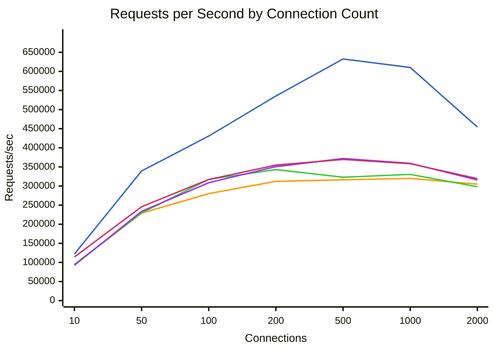
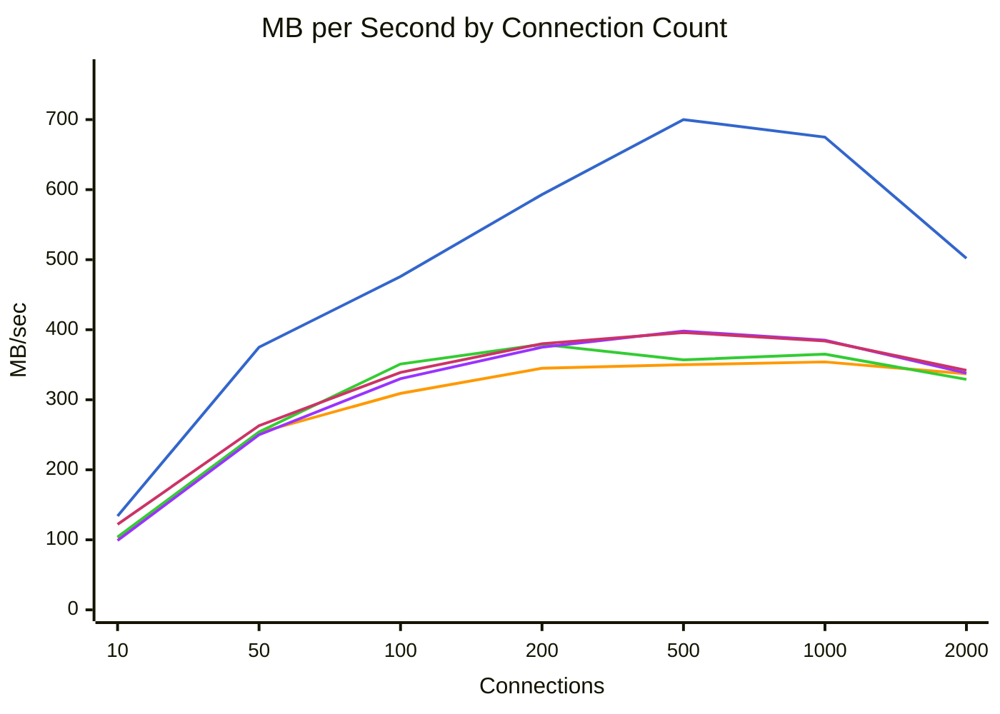
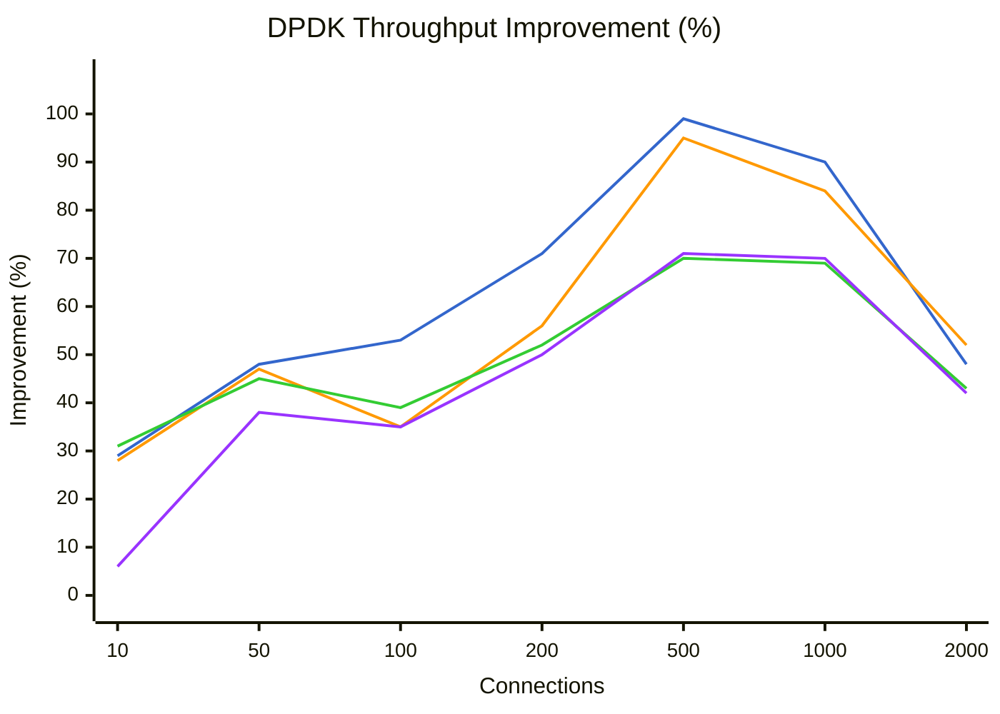
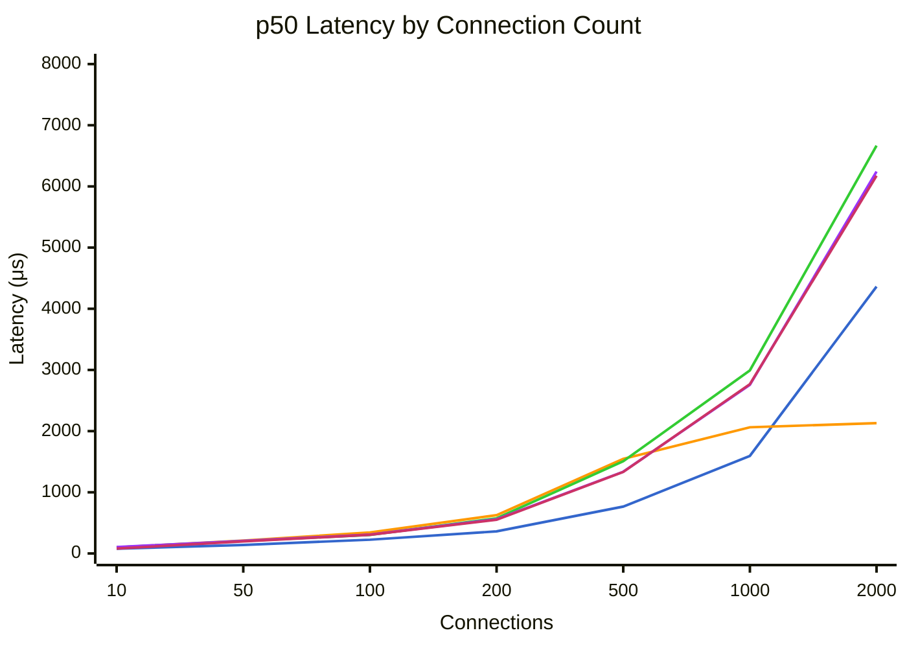
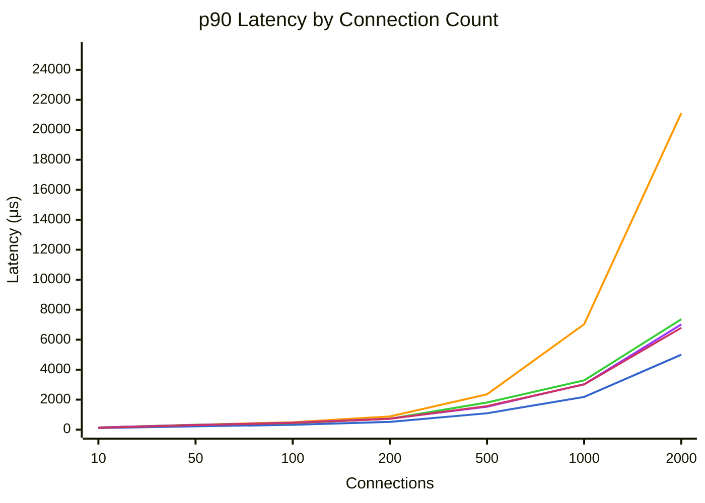
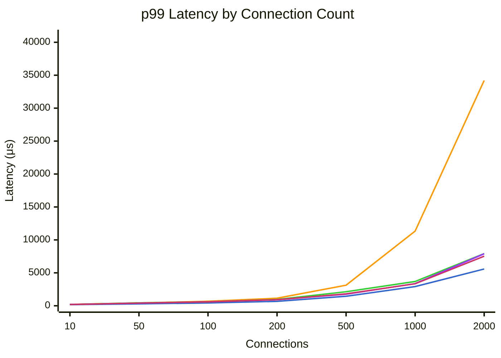

# Benchmark Comparison

Generated: 2026-01-30T20:44:39.846387

Modes tested: dpdk, tokio, tokio-local, kimojio, kimojio-poll

## Summary

| Mode | Connections | Requests/sec | MB/sec | p50 (μs) | p99 (μs) | Errors |
|------|-------------|--------------|--------|----------|----------|--------|
| dpdk | 10 | 121768 | 134.7 | 78 | 163 | 0 |
| dpdk | 50 | 339296 | 375.4 | 140 | 297 | 0 |
| dpdk | 100 | 430684 | 476.8 | 225 | 422 | 0 |
| dpdk | 200 | 535656 | 593.1 | 361 | 672 | 0 |
| dpdk | 500 | 632534 | 700.4 | 766 | 1446 | 0 |
| dpdk | 1000 | 610277 | 675.7 | 1595 | 2913 | 0 |
| dpdk | 2000 | 454203 | 502.9 | 4363 | 5583 | 0 |
| tokio | 10 | 93935 | 103.9 | 100 | 215 | 0 |
| tokio | 50 | 228927 | 253.2 | 212 | 434 | 0 |
| tokio | 100 | 280049 | 309.9 | 343 | 684 | 0 |
| tokio | 200 | 312273 | 345.8 | 626 | 1149 | 0 |
| tokio | 500 | 316405 | 350.3 | 1546 | 3125 | 0 |
| tokio | 1000 | 319908 | 354.2 | 2063 | 11335 | 0 |
| tokio | 2000 | 304954 | 337.6 | 2131 | 34207 | 0 |
| tokio-local | 10 | 94880 | 104.9 | 100 | 199 | 0 |
| tokio-local | 50 | 229613 | 254.0 | 204 | 437 | 0 |
| tokio-local | 100 | 317427 | 351.3 | 304 | 588 | 0 |
| tokio-local | 200 | 343057 | 379.8 | 574 | 958 | 0 |
| tokio-local | 500 | 322962 | 357.6 | 1507 | 2133 | 0 |
| tokio-local | 1000 | 330490 | 365.9 | 2993 | 3687 | 0 |
| tokio-local | 2000 | 297978 | 329.9 | 6667 | 7927 | 0 |
| kimojio | 10 | 92563 | 99.1 | 104 | 200 | 0 |
| kimojio | 50 | 233653 | 250.2 | 206 | 401 | 0 |
| kimojio | 100 | 308582 | 330.6 | 308 | 604 | 0 |
| kimojio | 200 | 350700 | 375.9 | 559 | 914 | 0 |
| kimojio | 500 | 371981 | 398.7 | 1336 | 1759 | 0 |
| kimojio | 1000 | 359372 | 385.2 | 2757 | 3367 | 0 |
| kimojio | 2000 | 315767 | 338.5 | 6243 | 7891 | 0 |
| kimojio-poll | 10 | 114170 | 122.2 | 80 | 193 | 0 |
| kimojio-poll | 50 | 245673 | 263.1 | 198 | 407 | 0 |
| kimojio-poll | 100 | 317014 | 339.7 | 305 | 594 | 0 |
| kimojio-poll | 200 | 354760 | 380.3 | 551 | 917 | 0 |
| kimojio-poll | 500 | 369531 | 396.1 | 1333 | 1810 | 0 |
| kimojio-poll | 1000 | 358372 | 384.1 | 2767 | 3343 | 0 |
| kimojio-poll | 2000 | 319443 | 342.4 | 6175 | 7527 | 0 |

## Throughput Comparison



**Legend:** dpdk (blue) | tokio (orange) | tokio-local (green) | kimojio (purple) | kimojio-poll (pink)


## Bandwidth Comparison



**Legend:** dpdk (blue) | tokio (orange) | tokio-local (green) | kimojio (purple) | kimojio-poll (pink)


## DPDK Throughput Improvement

Percentage improvement of DPDK over other modes (positive = DPDK is faster).



**Legend:** vs tokio (blue) | vs tokio-local (orange) | vs kimojio (green) | vs kimojio-poll (purple)


## Latency Comparison (p50)



**Legend:** dpdk (blue) | tokio (orange) | tokio-local (green) | kimojio (purple) | kimojio-poll (pink)


## Latency Comparison (p90)



**Legend:** dpdk (blue) | tokio (orange) | tokio-local (green) | kimojio (purple) | kimojio-poll (pink)


## Latency Comparison (p99)



**Legend:** dpdk (blue) | tokio (orange) | tokio-local (green) | kimojio (purple) | kimojio-poll (pink)


## Raw Data

### dpdk

<details>
<summary>Click to expand</summary>

```json
{
  "benchmark_time": "2026-01-31T04:30:57+00:00",
  "results": [
    {
      "url": "http://10.0.0.5:8080/",
      "connections": 10,
      "duration_secs": 20.0,
      "mode": "raw",
      "worker_threads": 8,
      "timeout_ms": 5000,
      "requests": 2435355,
      "errors": 0,
      "gb_read": 2.63,
      "requests_per_sec": 121767.75,
      "mb_per_sec": 134.65,
      "latency": {
        "p50_us": 78,
        "p75_us": 90,
        "p90_us": 107,
        "p99_us": 163,
        "avg_us": 81,
        "max_us": 8615,
        "stdev_us": 29
      }
    },
    {
      "url": "http://10.0.0.5:8080/",
      "connections": 50,
      "duration_secs": 20.0,
      "mode": "raw",
      "worker_threads": 8,
      "timeout_ms": 5000,
      "requests": 6785924,
      "errors": 0,
      "gb_read": 7.33,
      "requests_per_sec": 339296.2,
      "mb_per_sec": 375.35,
      "latency": {
        "p50_us": 140,
        "p75_us": 177,
        "p90_us": 218,
        "p99_us": 297,
        "avg_us": 147,
        "max_us": 2643,
        "stdev_us": 51
      }
    },
    {
      "url": "http://10.0.0.5:8080/",
      "connections": 100,
      "duration_secs": 20.0,
      "mode": "raw",
      "worker_threads": 8,
      "timeout_ms": 5000,
      "requests": 8613682,
      "errors": 0,
      "gb_read": 9.31,
      "requests_per_sec": 430684.1,
      "mb_per_sec": 476.82,
      "latency": {
        "p50_us": 225,
        "p75_us": 275,
        "p90_us": 324,
        "p99_us": 422,
        "avg_us": 230,
        "max_us": 7495,
        "stdev_us": 76
      }
    },
    {
      "url": "http://10.0.0.5:8080/",
      "connections": 200,
      "duration_secs": 20.0,
      "mode": "raw",
      "worker_threads": 8,
      "timeout_ms": 5000,
      "requests": 10713116,
      "errors": 0,
      "gb_read": 11.58,
      "requests_per_sec": 535655.8,
      "mb_per_sec": 593.09,
      "latency": {
        "p50_us": 361,
        "p75_us": 438,
        "p90_us": 517,
        "p99_us": 672,
        "avg_us": 371,
        "max_us": 4707,
        "stdev_us": 111
      }
    },
    {
      "url": "http://10.0.0.5:8080/",
      "connections": 500,
      "duration_secs": 20.0,
      "mode": "raw",
      "worker_threads": 8,
      "timeout_ms": 5000,
      "requests": 12650683,
      "errors": 0,
      "gb_read": 13.68,
      "requests_per_sec": 632534.15,
      "mb_per_sec": 700.35,
      "latency": {
        "p50_us": 766,
        "p75_us": 925,
        "p90_us": 1090,
        "p99_us": 1446,
        "avg_us": 787,
        "max_us": 12359,
        "stdev_us": 244
      }
    },
    {
      "url": "http://10.0.0.5:8080/",
      "connections": 1000,
      "duration_secs": 20.0,
      "mode": "raw",
      "worker_threads": 8,
      "timeout_ms": 5000,
      "requests": 12205546,
      "errors": 0,
      "gb_read": 13.2,
      "requests_per_sec": 610277.3,
      "mb_per_sec": 675.71,
      "latency": {
        "p50_us": 1595,
        "p75_us": 1884,
        "p90_us": 2179,
        "p99_us": 2913,
        "avg_us": 1627,
        "max_us": 30479,
        "stdev_us": 466
      }
    },
    {
      "url": "http://10.0.0.5:8080/",
      "connections": 2000,
      "duration_secs": 20.0,
      "mode": "raw",
      "worker_threads": 8,
      "timeout_ms": 5000,
      "requests": 9084051,
      "errors": 0,
      "gb_read": 9.82,
      "requests_per_sec": 454202.55,
      "mb_per_sec": 502.9,
      "latency": {
        "p50_us": 4363,
        "p75_us": 4703,
        "p90_us": 4999,
        "p99_us": 5583,
        "avg_us": 4381,
        "max_us": 85439,
        "stdev_us": 687
      }
    }
  ]
}
```

</details>

### tokio

<details>
<summary>Click to expand</summary>

```json
{
  "benchmark_time": "2026-01-31T04:34:16+00:00",
  "results": [
    {
      "url": "http://10.0.0.4:8080/",
      "connections": 10,
      "duration_secs": 20.0,
      "mode": "raw",
      "worker_threads": 8,
      "timeout_ms": 5000,
      "requests": 1878700,
      "errors": 0,
      "gb_read": 2.03,
      "requests_per_sec": 93935.0,
      "mb_per_sec": 103.86,
      "latency": {
        "p50_us": 100,
        "p75_us": 118,
        "p90_us": 142,
        "p99_us": 215,
        "avg_us": 105,
        "max_us": 10215,
        "stdev_us": 40
      }
    },
    {
      "url": "http://10.0.0.4:8080/",
      "connections": 50,
      "duration_secs": 20.0,
      "mode": "raw",
      "worker_threads": 8,
      "timeout_ms": 5000,
      "requests": 4578532,
      "errors": 0,
      "gb_read": 4.95,
      "requests_per_sec": 228926.6,
      "mb_per_sec": 253.25,
      "latency": {
        "p50_us": 212,
        "p75_us": 265,
        "p90_us": 319,
        "p99_us": 434,
        "avg_us": 219,
        "max_us": 7007,
        "stdev_us": 81
      }
    },
    {
      "url": "http://10.0.0.4:8080/",
      "connections": 100,
      "duration_secs": 20.0,
      "mode": "raw",
      "worker_threads": 8,
      "timeout_ms": 5000,
      "requests": 5600983,
      "errors": 0,
      "gb_read": 6.05,
      "requests_per_sec": 280049.15,
      "mb_per_sec": 309.91,
      "latency": {
        "p50_us": 343,
        "p75_us": 417,
        "p90_us": 495,
        "p99_us": 684,
        "avg_us": 354,
        "max_us": 7171,
        "stdev_us": 113
      }
    },
    {
      "url": "http://10.0.0.4:8080/",
      "connections": 200,
      "duration_secs": 20.0,
      "mode": "raw",
      "worker_threads": 8,
      "timeout_ms": 5000,
      "requests": 6245464,
      "errors": 0,
      "gb_read": 6.75,
      "requests_per_sec": 312273.2,
      "mb_per_sec": 345.75,
      "latency": {
        "p50_us": 626,
        "p75_us": 752,
        "p90_us": 878,
        "p99_us": 1149,
        "avg_us": 638,
        "max_us": 14727,
        "stdev_us": 204
      }
    },
    {
      "url": "http://10.0.0.4:8080/",
      "connections": 500,
      "duration_secs": 20.0,
      "mode": "raw",
      "worker_threads": 8,
      "timeout_ms": 5000,
      "requests": 6328093,
      "errors": 0,
      "gb_read": 6.84,
      "requests_per_sec": 316404.65,
      "mb_per_sec": 350.33,
      "latency": {
        "p50_us": 1546,
        "p75_us": 1969,
        "p90_us": 2355,
        "p99_us": 3125,
        "avg_us": 1575,
        "max_us": 207615,
        "stdev_us": 620
      }
    },
    {
      "url": "http://10.0.0.4:8080/",
      "connections": 1000,
      "duration_secs": 20.0,
      "mode": "raw",
      "worker_threads": 8,
      "timeout_ms": 5000,
      "requests": 6398161,
      "errors": 0,
      "gb_read": 6.92,
      "requests_per_sec": 319908.05,
      "mb_per_sec": 354.21,
      "latency": {
        "p50_us": 2063,
        "p75_us": 4199,
        "p90_us": 7031,
        "p99_us": 11335,
        "avg_us": 3113,
        "max_us": 34623,
        "stdev_us": 2545
      }
    },
    {
      "url": "http://10.0.0.4:8080/",
      "connections": 2000,
      "duration_secs": 20.0,
      "mode": "raw",
      "worker_threads": 8,
      "timeout_ms": 5000,
      "requests": 6099083,
      "errors": 0,
      "gb_read": 6.59,
      "requests_per_sec": 304954.15,
      "mb_per_sec": 337.65,
      "latency": {
        "p50_us": 2131,
        "p75_us": 3525,
        "p90_us": 21119,
        "p99_us": 34207,
        "avg_us": 6533,
        "max_us": 207103,
        "stdev_us": 8733
      }
    }
  ]
}
```

</details>

### tokio-local

<details>
<summary>Click to expand</summary>

```json
{
  "benchmark_time": "2026-01-31T04:37:35+00:00",
  "results": [
    {
      "url": "http://10.0.0.4:8080/",
      "connections": 10,
      "duration_secs": 20.0,
      "mode": "raw",
      "worker_threads": 8,
      "timeout_ms": 5000,
      "requests": 1897594,
      "errors": 0,
      "gb_read": 2.05,
      "requests_per_sec": 94879.7,
      "mb_per_sec": 104.91,
      "latency": {
        "p50_us": 100,
        "p75_us": 116,
        "p90_us": 138,
        "p99_us": 199,
        "avg_us": 104,
        "max_us": 9647,
        "stdev_us": 39
      }
    },
    {
      "url": "http://10.0.0.4:8080/",
      "connections": 50,
      "duration_secs": 20.0,
      "mode": "raw",
      "worker_threads": 8,
      "timeout_ms": 5000,
      "requests": 4592251,
      "errors": 0,
      "gb_read": 4.96,
      "requests_per_sec": 229612.55,
      "mb_per_sec": 254.01,
      "latency": {
        "p50_us": 204,
        "p75_us": 267,
        "p90_us": 320,
        "p99_us": 437,
        "avg_us": 212,
        "max_us": 15063,
        "stdev_us": 91
      }
    },
    {
      "url": "http://10.0.0.4:8080/",
      "connections": 100,
      "duration_secs": 20.0,
      "mode": "raw",
      "worker_threads": 8,
      "timeout_ms": 5000,
      "requests": 6348538,
      "errors": 0,
      "gb_read": 6.86,
      "requests_per_sec": 317426.9,
      "mb_per_sec": 351.29,
      "latency": {
        "p50_us": 304,
        "p75_us": 370,
        "p90_us": 435,
        "p99_us": 588,
        "avg_us": 313,
        "max_us": 5271,
        "stdev_us": 96
      }
    },
    {
      "url": "http://10.0.0.4:8080/",
      "connections": 200,
      "duration_secs": 20.0,
      "mode": "raw",
      "worker_threads": 8,
      "timeout_ms": 5000,
      "requests": 6861137,
      "errors": 0,
      "gb_read": 7.42,
      "requests_per_sec": 343056.85,
      "mb_per_sec": 379.84,
      "latency": {
        "p50_us": 574,
        "p75_us": 651,
        "p90_us": 730,
        "p99_us": 958,
        "avg_us": 580,
        "max_us": 8207,
        "stdev_us": 133
      }
    },
    {
      "url": "http://10.0.0.4:8080/",
      "connections": 500,
      "duration_secs": 20.0,
      "mode": "raw",
      "worker_threads": 8,
      "timeout_ms": 5000,
      "requests": 6459243,
      "errors": 0,
      "gb_read": 6.98,
      "requests_per_sec": 322962.15,
      "mb_per_sec": 357.59,
      "latency": {
        "p50_us": 1507,
        "p75_us": 1673,
        "p90_us": 1808,
        "p99_us": 2133,
        "avg_us": 1546,
        "max_us": 12039,
        "stdev_us": 230
      }
    },
    {
      "url": "http://10.0.0.4:8080/",
      "connections": 1000,
      "duration_secs": 20.0,
      "mode": "raw",
      "worker_threads": 8,
      "timeout_ms": 5000,
      "requests": 6609795,
      "errors": 0,
      "gb_read": 7.15,
      "requests_per_sec": 330489.75,
      "mb_per_sec": 365.92,
      "latency": {
        "p50_us": 2993,
        "p75_us": 3137,
        "p90_us": 3285,
        "p99_us": 3687,
        "avg_us": 3013,
        "max_us": 30671,
        "stdev_us": 294
      }
    },
    {
      "url": "http://10.0.0.4:8080/",
      "connections": 2000,
      "duration_secs": 20.0,
      "mode": "raw",
      "worker_threads": 8,
      "timeout_ms": 5000,
      "requests": 5959558,
      "errors": 0,
      "gb_read": 6.44,
      "requests_per_sec": 297977.9,
      "mb_per_sec": 329.93,
      "latency": {
        "p50_us": 6667,
        "p75_us": 7047,
        "p90_us": 7367,
        "p99_us": 7927,
        "avg_us": 6676,
        "max_us": 67647,
        "stdev_us": 756
      }
    }
  ]
}
```

</details>

### kimojio

<details>
<summary>Click to expand</summary>

```json
{
  "benchmark_time": "2026-01-31T04:40:54+00:00",
  "results": [
    {
      "url": "http://10.0.0.4:8080/",
      "connections": 10,
      "duration_secs": 20.0,
      "mode": "raw",
      "worker_threads": 8,
      "timeout_ms": 5000,
      "requests": 1851257,
      "errors": 0,
      "gb_read": 1.94,
      "requests_per_sec": 92562.85,
      "mb_per_sec": 99.08,
      "latency": {
        "p50_us": 104,
        "p75_us": 121,
        "p90_us": 142,
        "p99_us": 200,
        "avg_us": 107,
        "max_us": 6979,
        "stdev_us": 32
      }
    },
    {
      "url": "http://10.0.0.4:8080/",
      "connections": 50,
      "duration_secs": 20.0,
      "mode": "raw",
      "worker_threads": 8,
      "timeout_ms": 5000,
      "requests": 4673060,
      "errors": 0,
      "gb_read": 4.89,
      "requests_per_sec": 233653.0,
      "mb_per_sec": 250.24,
      "latency": {
        "p50_us": 206,
        "p75_us": 258,
        "p90_us": 304,
        "p99_us": 401,
        "avg_us": 210,
        "max_us": 8911,
        "stdev_us": 77
      }
    },
    {
      "url": "http://10.0.0.4:8080/",
      "connections": 100,
      "duration_secs": 20.0,
      "mode": "raw",
      "worker_threads": 8,
      "timeout_ms": 5000,
      "requests": 6171649,
      "errors": 0,
      "gb_read": 6.46,
      "requests_per_sec": 308582.45,
      "mb_per_sec": 330.61,
      "latency": {
        "p50_us": 308,
        "p75_us": 381,
        "p90_us": 454,
        "p99_us": 604,
        "avg_us": 320,
        "max_us": 7271,
        "stdev_us": 108
      }
    },
    {
      "url": "http://10.0.0.4:8080/",
      "connections": 200,
      "duration_secs": 20.0,
      "mode": "raw",
      "worker_threads": 8,
      "timeout_ms": 5000,
      "requests": 7013995,
      "errors": 0,
      "gb_read": 7.34,
      "requests_per_sec": 350699.75,
      "mb_per_sec": 375.93,
      "latency": {
        "p50_us": 559,
        "p75_us": 647,
        "p90_us": 730,
        "p99_us": 914,
        "avg_us": 570,
        "max_us": 208639,
        "stdev_us": 319
      }
    },
    {
      "url": "http://10.0.0.4:8080/",
      "connections": 500,
      "duration_secs": 20.0,
      "mode": "raw",
      "worker_threads": 8,
      "timeout_ms": 5000,
      "requests": 7439619,
      "errors": 0,
      "gb_read": 7.79,
      "requests_per_sec": 371980.95,
      "mb_per_sec": 398.74,
      "latency": {
        "p50_us": 1336,
        "p75_us": 1432,
        "p90_us": 1525,
        "p99_us": 1759,
        "avg_us": 1339,
        "max_us": 28927,
        "stdev_us": 177
      }
    },
    {
      "url": "http://10.0.0.4:8080/",
      "connections": 1000,
      "duration_secs": 20.0,
      "mode": "raw",
      "worker_threads": 8,
      "timeout_ms": 5000,
      "requests": 7187443,
      "errors": 0,
      "gb_read": 7.52,
      "requests_per_sec": 359372.15,
      "mb_per_sec": 385.22,
      "latency": {
        "p50_us": 2757,
        "p75_us": 2883,
        "p90_us": 3025,
        "p99_us": 3367,
        "avg_us": 2776,
        "max_us": 35135,
        "stdev_us": 283
      }
    },
    {
      "url": "http://10.0.0.4:8080/",
      "connections": 2000,
      "duration_secs": 20.0,
      "mode": "raw",
      "worker_threads": 8,
      "timeout_ms": 5000,
      "requests": 6315336,
      "errors": 0,
      "gb_read": 6.61,
      "requests_per_sec": 315766.8,
      "mb_per_sec": 338.48,
      "latency": {
        "p50_us": 6243,
        "p75_us": 6639,
        "p90_us": 7023,
        "p99_us": 7891,
        "avg_us": 6289,
        "max_us": 214527,
        "stdev_us": 1010
      }
    }
  ]
}
```

</details>

### kimojio-poll

<details>
<summary>Click to expand</summary>

```json
{
  "benchmark_time": "2026-01-31T04:44:18+00:00",
  "results": [
    {
      "url": "http://10.0.0.4:8080/",
      "connections": 10,
      "duration_secs": 20.0,
      "mode": "raw",
      "worker_threads": 8,
      "timeout_ms": 5000,
      "requests": 2283404,
      "errors": 0,
      "gb_read": 2.39,
      "requests_per_sec": 114170.2,
      "mb_per_sec": 122.22,
      "latency": {
        "p50_us": 80,
        "p75_us": 97,
        "p90_us": 122,
        "p99_us": 193,
        "avg_us": 86,
        "max_us": 6259,
        "stdev_us": 31
      }
    },
    {
      "url": "http://10.0.0.4:8080/",
      "connections": 50,
      "duration_secs": 20.0,
      "mode": "raw",
      "worker_threads": 8,
      "timeout_ms": 5000,
      "requests": 4913459,
      "errors": 0,
      "gb_read": 5.14,
      "requests_per_sec": 245672.95,
      "mb_per_sec": 263.11,
      "latency": {
        "p50_us": 198,
        "p75_us": 253,
        "p90_us": 304,
        "p99_us": 407,
        "avg_us": 204,
        "max_us": 11103,
        "stdev_us": 83
      }
    },
    {
      "url": "http://10.0.0.4:8080/",
      "connections": 100,
      "duration_secs": 20.0,
      "mode": "raw",
      "worker_threads": 8,
      "timeout_ms": 5000,
      "requests": 6340286,
      "errors": 0,
      "gb_read": 6.63,
      "requests_per_sec": 317014.3,
      "mb_per_sec": 339.68,
      "latency": {
        "p50_us": 305,
        "p75_us": 372,
        "p90_us": 444,
        "p99_us": 594,
        "avg_us": 316,
        "max_us": 6807,
        "stdev_us": 102
      }
    },
    {
      "url": "http://10.0.0.4:8080/",
      "connections": 200,
      "duration_secs": 20.0,
      "mode": "raw",
      "worker_threads": 8,
      "timeout_ms": 5000,
      "requests": 7095202,
      "errors": 0,
      "gb_read": 7.43,
      "requests_per_sec": 354760.1,
      "mb_per_sec": 380.28,
      "latency": {
        "p50_us": 551,
        "p75_us": 640,
        "p90_us": 725,
        "p99_us": 917,
        "avg_us": 562,
        "max_us": 13783,
        "stdev_us": 132
      }
    },
    {
      "url": "http://10.0.0.4:8080/",
      "connections": 500,
      "duration_secs": 20.0,
      "mode": "raw",
      "worker_threads": 8,
      "timeout_ms": 5000,
      "requests": 7390619,
      "errors": 0,
      "gb_read": 7.74,
      "requests_per_sec": 369530.95,
      "mb_per_sec": 396.11,
      "latency": {
        "p50_us": 1333,
        "p75_us": 1450,
        "p90_us": 1568,
        "p99_us": 1810,
        "avg_us": 1342,
        "max_us": 36799,
        "stdev_us": 210
      }
    },
    {
      "url": "http://10.0.0.4:8080/",
      "connections": 1000,
      "duration_secs": 20.0,
      "mode": "raw",
      "worker_threads": 8,
      "timeout_ms": 5000,
      "requests": 7167434,
      "errors": 0,
      "gb_read": 7.5,
      "requests_per_sec": 358371.7,
      "mb_per_sec": 384.15,
      "latency": {
        "p50_us": 2767,
        "p75_us": 2885,
        "p90_us": 3017,
        "p99_us": 3343,
        "avg_us": 2779,
        "max_us": 73663,
        "stdev_us": 319
      }
    },
    {
      "url": "http://10.0.0.4:8080/",
      "connections": 2000,
      "duration_secs": 20.0,
      "mode": "raw",
      "worker_threads": 8,
      "timeout_ms": 5000,
      "requests": 6388857,
      "errors": 0,
      "gb_read": 6.69,
      "requests_per_sec": 319442.85,
      "mb_per_sec": 342.42,
      "latency": {
        "p50_us": 6175,
        "p75_us": 6467,
        "p90_us": 6795,
        "p99_us": 7527,
        "avg_us": 6229,
        "max_us": 265983,
        "stdev_us": 1224
      }
    }
  ]
}
```

</details>
