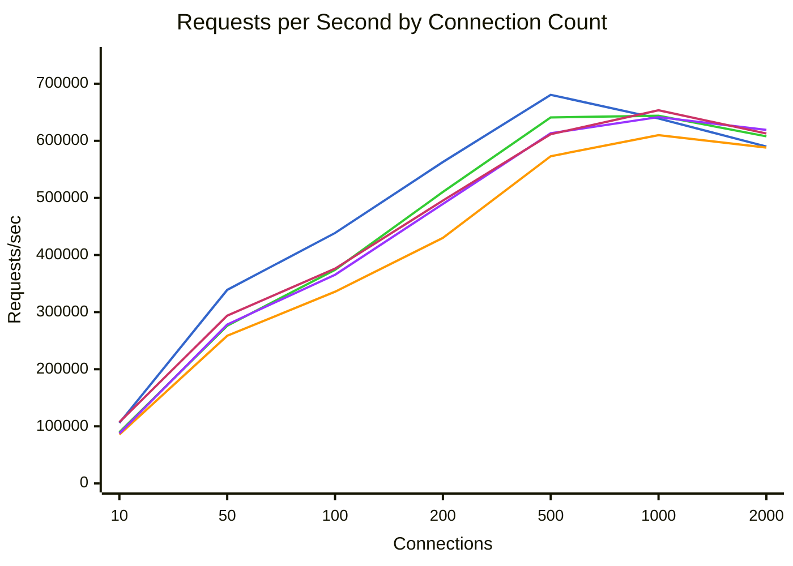
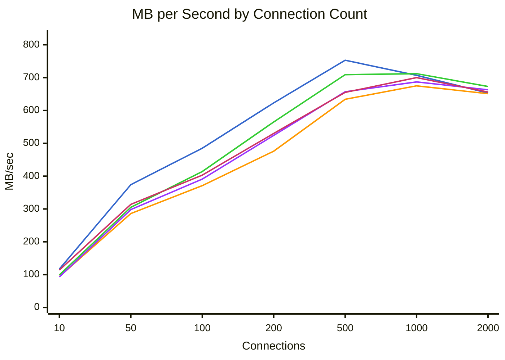
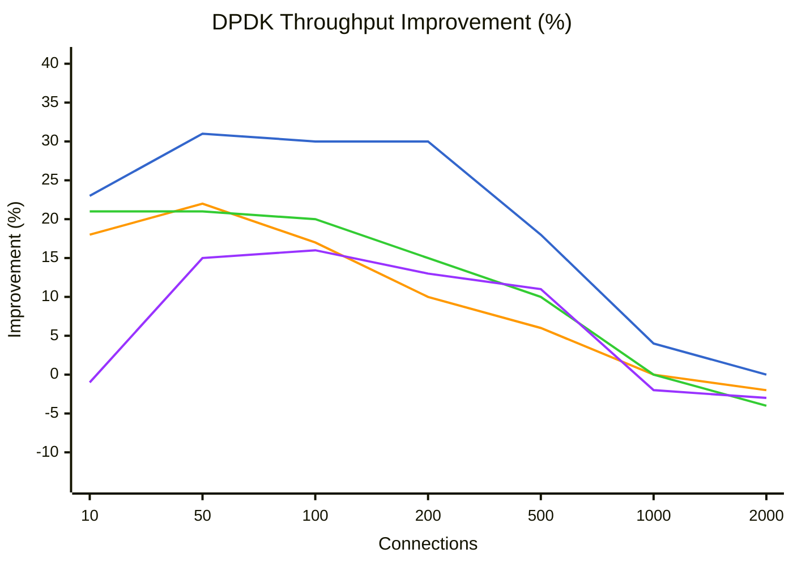
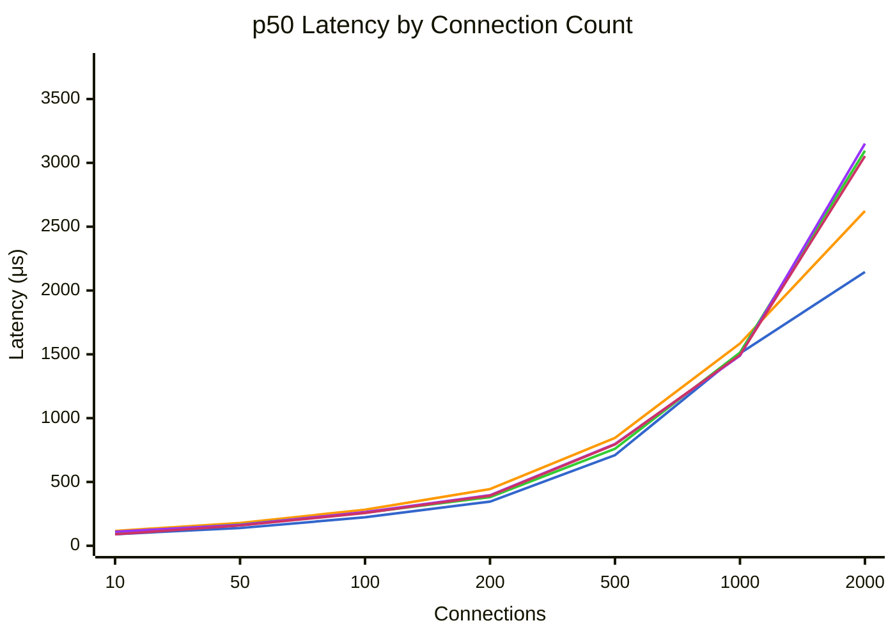
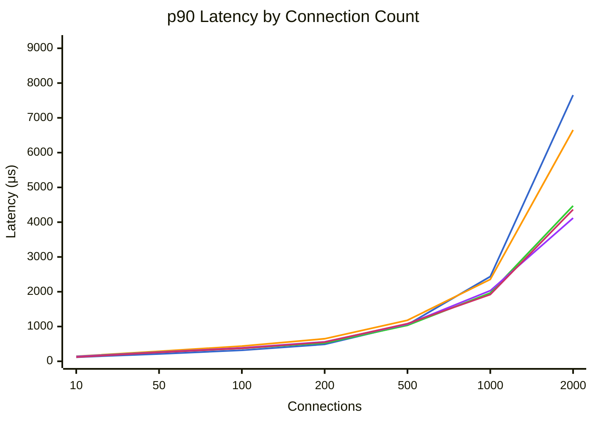
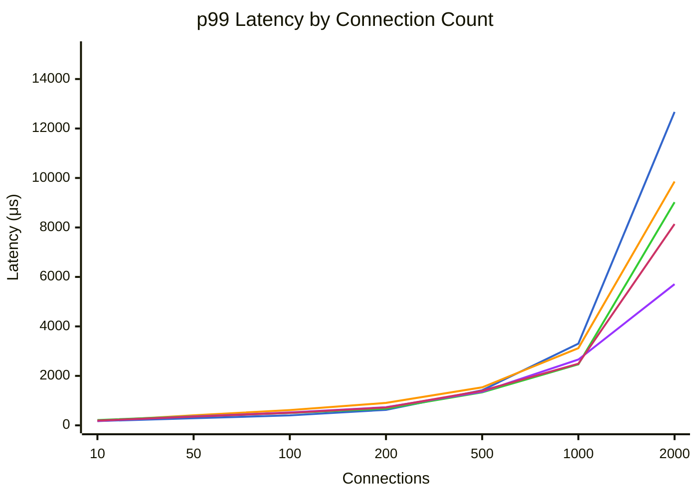

# Benchmark Comparison

Generated: 2026-01-30T21:03:11.738983

Modes tested: dpdk, tokio, tokio-local, kimojio, kimojio-poll

## Summary

| Mode | Connections | Requests/sec | MB/sec | p50 (μs) | p99 (μs) | Errors |
|------|-------------|--------------|--------|----------|----------|--------|
| dpdk | 10 | 106018 | 117.2 | 91 | 175 | 0 |
| dpdk | 50 | 338963 | 375.0 | 139 | 290 | 0 |
| dpdk | 100 | 438589 | 485.6 | 223 | 402 | 0 |
| dpdk | 200 | 562854 | 623.2 | 346 | 628 | 0 |
| dpdk | 500 | 680554 | 753.5 | 710 | 1420 | 0 |
| dpdk | 1000 | 639017 | 707.5 | 1507 | 3303 | 0 |
| dpdk | 2000 | 590072 | 653.3 | 2145 | 12671 | 0 |
| tokio | 10 | 85577 | 94.6 | 116 | 180 | 0 |
| tokio | 50 | 258537 | 286.0 | 179 | 405 | 0 |
| tokio | 100 | 335725 | 371.6 | 282 | 618 | 0 |
| tokio | 200 | 429962 | 476.1 | 444 | 907 | 0 |
| tokio | 500 | 573047 | 634.5 | 845 | 1537 | 0 |
| tokio | 1000 | 609956 | 675.4 | 1585 | 3121 | 0 |
| tokio | 2000 | 588124 | 651.2 | 2623 | 9855 | 0 |
| tokio-local | 10 | 89698 | 99.2 | 106 | 215 | 0 |
| tokio-local | 50 | 276166 | 305.5 | 166 | 366 | 0 |
| tokio-local | 100 | 374099 | 414.1 | 260 | 502 | 0 |
| tokio-local | 200 | 510392 | 565.1 | 381 | 676 | 0 |
| tokio-local | 500 | 640959 | 709.7 | 760 | 1334 | 0 |
| tokio-local | 1000 | 643845 | 712.9 | 1514 | 2467 | 0 |
| tokio-local | 2000 | 607886 | 673.1 | 3095 | 9023 | 0 |
| kimojio | 10 | 87593 | 93.8 | 110 | 180 | 0 |
| kimojio | 50 | 278363 | 298.1 | 164 | 360 | 0 |
| kimojio | 100 | 365432 | 391.6 | 264 | 521 | 0 |
| kimojio | 200 | 489360 | 524.6 | 396 | 732 | 0 |
| kimojio | 500 | 613255 | 657.4 | 797 | 1361 | 0 |
| kimojio | 1000 | 641544 | 687.7 | 1489 | 2661 | 0 |
| kimojio | 2000 | 619086 | 663.6 | 3151 | 5707 | 0 |
| kimojio-poll | 10 | 107327 | 114.9 | 90 | 193 | 0 |
| kimojio-poll | 50 | 293844 | 314.7 | 159 | 352 | 0 |
| kimojio-poll | 100 | 376177 | 403.1 | 257 | 505 | 0 |
| kimojio-poll | 200 | 495320 | 531.0 | 392 | 723 | 0 |
| kimojio-poll | 500 | 611555 | 655.5 | 794 | 1396 | 0 |
| kimojio-poll | 1000 | 653425 | 700.4 | 1495 | 2493 | 0 |
| kimojio-poll | 2000 | 612771 | 656.9 | 3053 | 8139 | 0 |

## Throughput Comparison



**Legend:** dpdk (blue) | tokio (orange) | tokio-local (green) | kimojio (purple) | kimojio-poll (pink)


## Bandwidth Comparison



**Legend:** dpdk (blue) | tokio (orange) | tokio-local (green) | kimojio (purple) | kimojio-poll (pink)


## DPDK Throughput Improvement

Percentage improvement of DPDK over other modes (positive = DPDK is faster).



**Legend:** vs tokio (blue) | vs tokio-local (orange) | vs kimojio (green) | vs kimojio-poll (purple)


## Latency Comparison (p50)



**Legend:** dpdk (blue) | tokio (orange) | tokio-local (green) | kimojio (purple) | kimojio-poll (pink)


## Latency Comparison (p90)



**Legend:** dpdk (blue) | tokio (orange) | tokio-local (green) | kimojio (purple) | kimojio-poll (pink)


## Latency Comparison (p99)



**Legend:** dpdk (blue) | tokio (orange) | tokio-local (green) | kimojio (purple) | kimojio-poll (pink)


## Raw Data

### dpdk

<details>
<summary>Click to expand</summary>

```json
{
  "benchmark_time": "2026-01-31T04:49:30+00:00",
  "results": [
    {
      "url": "http://10.0.0.5:8080/",
      "connections": 10,
      "duration_secs": 20.0,
      "mode": "raw",
      "worker_threads": 8,
      "timeout_ms": 5000,
      "requests": 2120355,
      "errors": 0,
      "gb_read": 2.29,
      "requests_per_sec": 106017.75,
      "mb_per_sec": 117.23,
      "latency": {
        "p50_us": 91,
        "p75_us": 103,
        "p90_us": 118,
        "p99_us": 175,
        "avg_us": 94,
        "max_us": 12831,
        "stdev_us": 37
      }
    },
    {
      "url": "http://10.0.0.5:8080/",
      "connections": 50,
      "duration_secs": 20.0,
      "mode": "raw",
      "worker_threads": 8,
      "timeout_ms": 5000,
      "requests": 6779262,
      "errors": 0,
      "gb_read": 7.32,
      "requests_per_sec": 338963.1,
      "mb_per_sec": 374.98,
      "latency": {
        "p50_us": 139,
        "p75_us": 173,
        "p90_us": 212,
        "p99_us": 290,
        "avg_us": 146,
        "max_us": 7255,
        "stdev_us": 49
      }
    },
    {
      "url": "http://10.0.0.5:8080/",
      "connections": 100,
      "duration_secs": 20.0,
      "mode": "raw",
      "worker_threads": 8,
      "timeout_ms": 5000,
      "requests": 8771778,
      "errors": 0,
      "gb_read": 9.48,
      "requests_per_sec": 438588.9,
      "mb_per_sec": 485.56,
      "latency": {
        "p50_us": 223,
        "p75_us": 270,
        "p90_us": 316,
        "p99_us": 402,
        "avg_us": 227,
        "max_us": 202879,
        "stdev_us": 217
      }
    },
    {
      "url": "http://10.0.0.5:8080/",
      "connections": 200,
      "duration_secs": 20.0,
      "mode": "raw",
      "worker_threads": 8,
      "timeout_ms": 5000,
      "requests": 11257084,
      "errors": 0,
      "gb_read": 12.17,
      "requests_per_sec": 562854.2,
      "mb_per_sec": 623.2,
      "latency": {
        "p50_us": 346,
        "p75_us": 416,
        "p90_us": 487,
        "p99_us": 628,
        "avg_us": 354,
        "max_us": 4783,
        "stdev_us": 102
      }
    },
    {
      "url": "http://10.0.0.5:8080/",
      "connections": 500,
      "duration_secs": 20.0,
      "mode": "raw",
      "worker_threads": 8,
      "timeout_ms": 5000,
      "requests": 13611081,
      "errors": 0,
      "gb_read": 14.72,
      "requests_per_sec": 680554.05,
      "mb_per_sec": 753.52,
      "latency": {
        "p50_us": 710,
        "p75_us": 876,
        "p90_us": 1054,
        "p99_us": 1420,
        "avg_us": 732,
        "max_us": 12239,
        "stdev_us": 251
      }
    },
    {
      "url": "http://10.0.0.5:8080/",
      "connections": 1000,
      "duration_secs": 20.0,
      "mode": "raw",
      "worker_threads": 8,
      "timeout_ms": 5000,
      "requests": 12780336,
      "errors": 0,
      "gb_read": 13.82,
      "requests_per_sec": 639016.8,
      "mb_per_sec": 707.53,
      "latency": {
        "p50_us": 1507,
        "p75_us": 1978,
        "p90_us": 2437,
        "p99_us": 3303,
        "avg_us": 1558,
        "max_us": 35871,
        "stdev_us": 673
      }
    },
    {
      "url": "http://10.0.0.5:8080/",
      "connections": 2000,
      "duration_secs": 20.0,
      "mode": "raw",
      "worker_threads": 8,
      "timeout_ms": 5000,
      "requests": 11801437,
      "errors": 0,
      "gb_read": 12.76,
      "requests_per_sec": 590071.85,
      "mb_per_sec": 653.34,
      "latency": {
        "p50_us": 2145,
        "p75_us": 5239,
        "p90_us": 7655,
        "p99_us": 12671,
        "avg_us": 3368,
        "max_us": 68607,
        "stdev_us": 2867
      }
    }
  ]
}
```

</details>

### tokio

<details>
<summary>Click to expand</summary>

```json
{
  "benchmark_time": "2026-01-31T04:52:50+00:00",
  "results": [
    {
      "url": "http://10.0.0.4:8080/",
      "connections": 10,
      "duration_secs": 20.0,
      "mode": "raw",
      "worker_threads": 8,
      "timeout_ms": 5000,
      "requests": 1711542,
      "errors": 0,
      "gb_read": 1.85,
      "requests_per_sec": 85577.1,
      "mb_per_sec": 94.62,
      "latency": {
        "p50_us": 116,
        "p75_us": 131,
        "p90_us": 144,
        "p99_us": 180,
        "avg_us": 117,
        "max_us": 9559,
        "stdev_us": 42
      }
    },
    {
      "url": "http://10.0.0.4:8080/",
      "connections": 50,
      "duration_secs": 20.0,
      "mode": "raw",
      "worker_threads": 8,
      "timeout_ms": 5000,
      "requests": 5170746,
      "errors": 0,
      "gb_read": 5.59,
      "requests_per_sec": 258537.3,
      "mb_per_sec": 286.01,
      "latency": {
        "p50_us": 179,
        "p75_us": 231,
        "p90_us": 289,
        "p99_us": 405,
        "avg_us": 192,
        "max_us": 7635,
        "stdev_us": 74
      }
    },
    {
      "url": "http://10.0.0.4:8080/",
      "connections": 100,
      "duration_secs": 20.0,
      "mode": "raw",
      "worker_threads": 8,
      "timeout_ms": 5000,
      "requests": 6714491,
      "errors": 0,
      "gb_read": 7.26,
      "requests_per_sec": 335724.55,
      "mb_per_sec": 371.57,
      "latency": {
        "p50_us": 282,
        "p75_us": 353,
        "p90_us": 436,
        "p99_us": 618,
        "avg_us": 298,
        "max_us": 11279,
        "stdev_us": 108
      }
    },
    {
      "url": "http://10.0.0.4:8080/",
      "connections": 200,
      "duration_secs": 20.0,
      "mode": "raw",
      "worker_threads": 8,
      "timeout_ms": 5000,
      "requests": 8599240,
      "errors": 0,
      "gb_read": 9.3,
      "requests_per_sec": 429962.0,
      "mb_per_sec": 476.06,
      "latency": {
        "p50_us": 444,
        "p75_us": 539,
        "p90_us": 648,
        "p99_us": 907,
        "avg_us": 464,
        "max_us": 6631,
        "stdev_us": 150
      }
    },
    {
      "url": "http://10.0.0.4:8080/",
      "connections": 500,
      "duration_secs": 20.0,
      "mode": "raw",
      "worker_threads": 8,
      "timeout_ms": 5000,
      "requests": 11460948,
      "errors": 0,
      "gb_read": 12.39,
      "requests_per_sec": 573047.4,
      "mb_per_sec": 634.49,
      "latency": {
        "p50_us": 845,
        "p75_us": 1008,
        "p90_us": 1180,
        "p99_us": 1537,
        "avg_us": 869,
        "max_us": 12167,
        "stdev_us": 242
      }
    },
    {
      "url": "http://10.0.0.4:8080/",
      "connections": 1000,
      "duration_secs": 20.0,
      "mode": "raw",
      "worker_threads": 8,
      "timeout_ms": 5000,
      "requests": 12199119,
      "errors": 0,
      "gb_read": 13.19,
      "requests_per_sec": 609955.95,
      "mb_per_sec": 675.35,
      "latency": {
        "p50_us": 1585,
        "p75_us": 1966,
        "p90_us": 2355,
        "p99_us": 3121,
        "avg_us": 1632,
        "max_us": 210303,
        "stdev_us": 579
      }
    },
    {
      "url": "http://10.0.0.4:8080/",
      "connections": 2000,
      "duration_secs": 20.0,
      "mode": "raw",
      "worker_threads": 8,
      "timeout_ms": 5000,
      "requests": 11762473,
      "errors": 0,
      "gb_read": 12.72,
      "requests_per_sec": 588123.65,
      "mb_per_sec": 651.18,
      "latency": {
        "p50_us": 2623,
        "p75_us": 4423,
        "p90_us": 6651,
        "p99_us": 9855,
        "avg_us": 3381,
        "max_us": 209407,
        "stdev_us": 2178
      }
    }
  ]
}
```

</details>

### tokio-local

<details>
<summary>Click to expand</summary>

```json
{
  "benchmark_time": "2026-01-31T04:56:09+00:00",
  "results": [
    {
      "url": "http://10.0.0.4:8080/",
      "connections": 10,
      "duration_secs": 20.0,
      "mode": "raw",
      "worker_threads": 8,
      "timeout_ms": 5000,
      "requests": 1793962,
      "errors": 0,
      "gb_read": 1.94,
      "requests_per_sec": 89698.1,
      "mb_per_sec": 99.18,
      "latency": {
        "p50_us": 106,
        "p75_us": 121,
        "p90_us": 140,
        "p99_us": 215,
        "avg_us": 111,
        "max_us": 13759,
        "stdev_us": 36
      }
    },
    {
      "url": "http://10.0.0.4:8080/",
      "connections": 50,
      "duration_secs": 20.0,
      "mode": "raw",
      "worker_threads": 8,
      "timeout_ms": 5000,
      "requests": 5523310,
      "errors": 0,
      "gb_read": 5.97,
      "requests_per_sec": 276165.5,
      "mb_per_sec": 305.51,
      "latency": {
        "p50_us": 166,
        "p75_us": 214,
        "p90_us": 266,
        "p99_us": 366,
        "avg_us": 178,
        "max_us": 7875,
        "stdev_us": 69
      }
    },
    {
      "url": "http://10.0.0.4:8080/",
      "connections": 100,
      "duration_secs": 20.0,
      "mode": "raw",
      "worker_threads": 8,
      "timeout_ms": 5000,
      "requests": 7481985,
      "errors": 0,
      "gb_read": 8.09,
      "requests_per_sec": 374099.25,
      "mb_per_sec": 414.08,
      "latency": {
        "p50_us": 260,
        "p75_us": 315,
        "p90_us": 373,
        "p99_us": 502,
        "avg_us": 266,
        "max_us": 10583,
        "stdev_us": 90
      }
    },
    {
      "url": "http://10.0.0.4:8080/",
      "connections": 200,
      "duration_secs": 20.0,
      "mode": "raw",
      "worker_threads": 8,
      "timeout_ms": 5000,
      "requests": 10207850,
      "errors": 0,
      "gb_read": 11.04,
      "requests_per_sec": 510392.5,
      "mb_per_sec": 565.11,
      "latency": {
        "p50_us": 381,
        "p75_us": 453,
        "p90_us": 525,
        "p99_us": 676,
        "avg_us": 389,
        "max_us": 8743,
        "stdev_us": 114
      }
    },
    {
      "url": "http://10.0.0.4:8080/",
      "connections": 500,
      "duration_secs": 20.0,
      "mode": "raw",
      "worker_threads": 8,
      "timeout_ms": 5000,
      "requests": 12819185,
      "errors": 0,
      "gb_read": 13.86,
      "requests_per_sec": 640959.25,
      "mb_per_sec": 709.68,
      "latency": {
        "p50_us": 760,
        "p75_us": 895,
        "p90_us": 1034,
        "p99_us": 1334,
        "avg_us": 778,
        "max_us": 24719,
        "stdev_us": 240
      }
    },
    {
      "url": "http://10.0.0.4:8080/",
      "connections": 1000,
      "duration_secs": 20.0,
      "mode": "raw",
      "worker_threads": 8,
      "timeout_ms": 5000,
      "requests": 12876893,
      "errors": 0,
      "gb_read": 13.92,
      "requests_per_sec": 643844.65,
      "mb_per_sec": 712.88,
      "latency": {
        "p50_us": 1514,
        "p75_us": 1742,
        "p90_us": 1966,
        "p99_us": 2467,
        "avg_us": 1550,
        "max_us": 31567,
        "stdev_us": 358
      }
    },
    {
      "url": "http://10.0.0.4:8080/",
      "connections": 2000,
      "duration_secs": 20.0,
      "mode": "raw",
      "worker_threads": 8,
      "timeout_ms": 5000,
      "requests": 12157718,
      "errors": 0,
      "gb_read": 13.15,
      "requests_per_sec": 607885.9,
      "mb_per_sec": 673.06,
      "latency": {
        "p50_us": 3095,
        "p75_us": 3493,
        "p90_us": 4471,
        "p99_us": 9023,
        "avg_us": 3268,
        "max_us": 77823,
        "stdev_us": 1531
      }
    }
  ]
}
```

</details>

### kimojio

<details>
<summary>Click to expand</summary>

```json
{
  "benchmark_time": "2026-01-31T04:59:28+00:00",
  "results": [
    {
      "url": "http://10.0.0.4:8080/",
      "connections": 10,
      "duration_secs": 20.0,
      "mode": "raw",
      "worker_threads": 8,
      "timeout_ms": 5000,
      "requests": 1751856,
      "errors": 0,
      "gb_read": 1.83,
      "requests_per_sec": 87592.8,
      "mb_per_sec": 93.76,
      "latency": {
        "p50_us": 110,
        "p75_us": 123,
        "p90_us": 135,
        "p99_us": 180,
        "avg_us": 111,
        "max_us": 10031,
        "stdev_us": 31
      }
    },
    {
      "url": "http://10.0.0.4:8080/",
      "connections": 50,
      "duration_secs": 20.0,
      "mode": "raw",
      "worker_threads": 8,
      "timeout_ms": 5000,
      "requests": 5567264,
      "errors": 0,
      "gb_read": 5.82,
      "requests_per_sec": 278363.2,
      "mb_per_sec": 298.12,
      "latency": {
        "p50_us": 164,
        "p75_us": 212,
        "p90_us": 263,
        "p99_us": 360,
        "avg_us": 176,
        "max_us": 5839,
        "stdev_us": 64
      }
    },
    {
      "url": "http://10.0.0.4:8080/",
      "connections": 100,
      "duration_secs": 20.0,
      "mode": "raw",
      "worker_threads": 8,
      "timeout_ms": 5000,
      "requests": 7308638,
      "errors": 0,
      "gb_read": 7.65,
      "requests_per_sec": 365431.9,
      "mb_per_sec": 391.59,
      "latency": {
        "p50_us": 264,
        "p75_us": 322,
        "p90_us": 386,
        "p99_us": 521,
        "avg_us": 272,
        "max_us": 7075,
        "stdev_us": 89
      }
    },
    {
      "url": "http://10.0.0.4:8080/",
      "connections": 200,
      "duration_secs": 20.0,
      "mode": "raw",
      "worker_threads": 8,
      "timeout_ms": 5000,
      "requests": 9787191,
      "errors": 0,
      "gb_read": 10.25,
      "requests_per_sec": 489359.55,
      "mb_per_sec": 524.56,
      "latency": {
        "p50_us": 396,
        "p75_us": 476,
        "p90_us": 558,
        "p99_us": 732,
        "avg_us": 407,
        "max_us": 208511,
        "stdev_us": 146
      }
    },
    {
      "url": "http://10.0.0.4:8080/",
      "connections": 500,
      "duration_secs": 20.0,
      "mode": "raw",
      "worker_threads": 8,
      "timeout_ms": 5000,
      "requests": 12265096,
      "errors": 0,
      "gb_read": 12.84,
      "requests_per_sec": 613254.8,
      "mb_per_sec": 657.37,
      "latency": {
        "p50_us": 797,
        "p75_us": 931,
        "p90_us": 1068,
        "p99_us": 1361,
        "avg_us": 813,
        "max_us": 22495,
        "stdev_us": 213
      }
    },
    {
      "url": "http://10.0.0.4:8080/",
      "connections": 1000,
      "duration_secs": 20.0,
      "mode": "raw",
      "worker_threads": 8,
      "timeout_ms": 5000,
      "requests": 12830886,
      "errors": 0,
      "gb_read": 13.43,
      "requests_per_sec": 641544.3,
      "mb_per_sec": 687.69,
      "latency": {
        "p50_us": 1489,
        "p75_us": 1737,
        "p90_us": 2031,
        "p99_us": 2661,
        "avg_us": 1547,
        "max_us": 30271,
        "stdev_us": 404
      }
    },
    {
      "url": "http://10.0.0.4:8080/",
      "connections": 2000,
      "duration_secs": 20.0,
      "mode": "raw",
      "worker_threads": 8,
      "timeout_ms": 5000,
      "requests": 12381711,
      "errors": 0,
      "gb_read": 12.96,
      "requests_per_sec": 619085.55,
      "mb_per_sec": 663.62,
      "latency": {
        "p50_us": 3151,
        "p75_us": 3635,
        "p90_us": 4119,
        "p99_us": 5707,
        "avg_us": 3219,
        "max_us": 66111,
        "stdev_us": 902
      }
    }
  ]
}
```

</details>

### kimojio-poll

<details>
<summary>Click to expand</summary>

```json
{
  "benchmark_time": "2026-01-31T05:02:51+00:00",
  "results": [
    {
      "url": "http://10.0.0.4:8080/",
      "connections": 10,
      "duration_secs": 20.0,
      "mode": "raw",
      "worker_threads": 8,
      "timeout_ms": 5000,
      "requests": 2146539,
      "errors": 0,
      "gb_read": 2.24,
      "requests_per_sec": 107326.95,
      "mb_per_sec": 114.89,
      "latency": {
        "p50_us": 90,
        "p75_us": 103,
        "p90_us": 121,
        "p99_us": 193,
        "avg_us": 94,
        "max_us": 10031,
        "stdev_us": 32
      }
    },
    {
      "url": "http://10.0.0.4:8080/",
      "connections": 50,
      "duration_secs": 20.0,
      "mode": "raw",
      "worker_threads": 8,
      "timeout_ms": 5000,
      "requests": 5876887,
      "errors": 0,
      "gb_read": 6.15,
      "requests_per_sec": 293844.35,
      "mb_per_sec": 314.7,
      "latency": {
        "p50_us": 159,
        "p75_us": 206,
        "p90_us": 257,
        "p99_us": 352,
        "avg_us": 169,
        "max_us": 8075,
        "stdev_us": 67
      }
    },
    {
      "url": "http://10.0.0.4:8080/",
      "connections": 100,
      "duration_secs": 20.0,
      "mode": "raw",
      "worker_threads": 8,
      "timeout_ms": 5000,
      "requests": 7523536,
      "errors": 0,
      "gb_read": 7.87,
      "requests_per_sec": 376176.8,
      "mb_per_sec": 403.14,
      "latency": {
        "p50_us": 257,
        "p75_us": 313,
        "p90_us": 373,
        "p99_us": 505,
        "avg_us": 263,
        "max_us": 8391,
        "stdev_us": 93
      }
    },
    {
      "url": "http://10.0.0.4:8080/",
      "connections": 200,
      "duration_secs": 20.0,
      "mode": "raw",
      "worker_threads": 8,
      "timeout_ms": 5000,
      "requests": 9906402,
      "errors": 0,
      "gb_read": 10.37,
      "requests_per_sec": 495320.1,
      "mb_per_sec": 530.95,
      "latency": {
        "p50_us": 392,
        "p75_us": 471,
        "p90_us": 552,
        "p99_us": 723,
        "avg_us": 402,
        "max_us": 5075,
        "stdev_us": 116
      }
    },
    {
      "url": "http://10.0.0.4:8080/",
      "connections": 500,
      "duration_secs": 20.0,
      "mode": "raw",
      "worker_threads": 8,
      "timeout_ms": 5000,
      "requests": 12231108,
      "errors": 0,
      "gb_read": 12.8,
      "requests_per_sec": 611555.4,
      "mb_per_sec": 655.54,
      "latency": {
        "p50_us": 794,
        "p75_us": 937,
        "p90_us": 1082,
        "p99_us": 1396,
        "avg_us": 812,
        "max_us": 11831,
        "stdev_us": 218
      }
    },
    {
      "url": "http://10.0.0.4:8080/",
      "connections": 1000,
      "duration_secs": 20.0,
      "mode": "raw",
      "worker_threads": 8,
      "timeout_ms": 5000,
      "requests": 13068500,
      "errors": 0,
      "gb_read": 13.68,
      "requests_per_sec": 653425.0,
      "mb_per_sec": 700.43,
      "latency": {
        "p50_us": 1495,
        "p75_us": 1700,
        "p90_us": 1920,
        "p99_us": 2493,
        "avg_us": 1526,
        "max_us": 27023,
        "stdev_us": 349
      }
    },
    {
      "url": "http://10.0.0.4:8080/",
      "connections": 2000,
      "duration_secs": 20.0,
      "mode": "raw",
      "worker_threads": 8,
      "timeout_ms": 5000,
      "requests": 12255416,
      "errors": 0,
      "gb_read": 12.83,
      "requests_per_sec": 612770.8,
      "mb_per_sec": 656.85,
      "latency": {
        "p50_us": 3053,
        "p75_us": 3603,
        "p90_us": 4363,
        "p99_us": 8139,
        "avg_us": 3251,
        "max_us": 209663,
        "stdev_us": 1274
      }
    }
  ]
}
```

</details>
